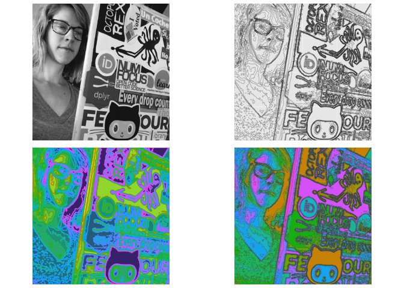

    library(magick)

    ## Linking to ImageMagick 6.9.9.39
    ## Enabled features: cairo, fontconfig, freetype, lcms, pango, rsvg, webp
    ## Disabled features: fftw, ghostscript, x11

    #> Linking to ImageMagick 6.9.9.39
    #> Enabled features: cairo, fontconfig, freetype, lcms, pango, rsvg, webp
    #> Disabled features: fftw, ghostscript, x11
    library(sf)

    ## Linking to GEOS 3.6.1, GDAL 2.1.3, PROJ 4.9.3

    library(ggplot2)
    library(isoband)
    library(colorspace)
    library(cowplot)

    ## 
    ## Attaching package: 'cowplot'

    ## The following object is masked from 'package:ggplot2':
    ## 
    ##     ggsave

    # set figure directory
    knitr::opts_chunk$set(fig.path = 'isopath_figs/')

    sf_from_image <- function(image) {
      image_gray <- image %>% image_quantize(colorspace = "gray")
      image_raster <- as.raster(image_gray)
      d <- dim(image_raster)
      m <- matrix(c((255-col2rgb(image_raster)[1,])), nrow = d[1], ncol = d[2], byrow = TRUE)
      b <- isobands(1:d[2], d[1]:1, m, 20*(-1:13), 20*(0:14))
      bands <- iso_to_sfg(b)
      data <- st_sf(
        level = letters[1:length(bands)],
        geometry = st_sfc(bands)
      )
    }

    img <- image_resize(image_read("https://avatars2.githubusercontent.com/u/7544197?s=460&v=4"), "200x200")
    img_sf <- sf_from_image(img)

    p0 <- ggdraw() + draw_image("https://avatars2.githubusercontent.com/u/7544197?s=460&v=4")

    p1 <- ggplot(img_sf) + 
      geom_sf(color = "gray10", fill = NA, size = 0.05) + 
      coord_sf(expand = FALSE) +
      theme_gray() +
      theme(
        axis.ticks = element_blank(),
        axis.text = element_blank(),
        axis.title = element_blank(),
        axis.ticks.length = grid::unit(0, "pt"),
        plot.margin = margin(0, 0, 0, 0)
      )

    p2 <- ggplot(img_sf) + 
      geom_sf(aes(fill = level, color = level)) + 
      coord_sf(expand = FALSE) +
      theme_void()

    p3 <- ggplot(img_sf) + 
      geom_sf(aes(fill = level), color = "gray30", size = 0.1) + 
      scale_fill_hue(aesthetics = c("color", "fill"), guide = "none", direction = -1) +
      coord_sf(expand = FALSE) +
      theme_void()

    cowplot::plot_grid(
      p0,
      p1,
      p2 + scale_fill_viridis_d(
        aesthetics = c("color", "fill"), option = "D", guide = "none",
        direction = -1) +
        theme(legend.position="none"),
      p3,
      scale = 0.95
    )

    cowplot::plot_grid(p0,p3, scale = 0.95)

