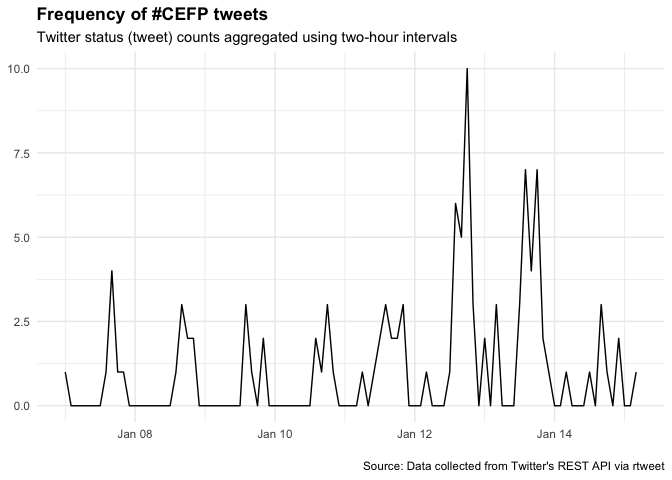

### Basic summary

There were a total of **107** tweets with the \#CEFP2019 hashtag. These
tweets were authored by **26** different particpants.

    ## # A tibble: 5 x 2
    ##   screen_name     text                                                    
    ##   <chr>           <chr>                                                   
    ## 1 raynamharris    This is a cool way to think about the stages conversati…
    ## 2 StefanieButland "I'm the luckiest community manager! Mentoring this wee…
    ## 3 serahrono       At the end of an impeccable first day at #CEFP2019, and…
    ## 4 Baker_aquatic   Excited to be in Washington for the kick off meeting on…
    ## 5 biotechchat     We're here, we're caffeinated and we're ready to kick o…

    ## <blockquote class="twitter-tweet" lang="en"> 
    ## 
This is a cool way to think about the stages conversation within communities. Early stages: one- or two-way conversations (convey and contribute). Later stages: collaboration and co-creation to generate novel ideas &amp; solutions to problems. From @LouWoodley at #CEFP2019 @TheCSCCE https://t.co/OvOV1SoQ5r
&mdash; <a href="https://twitter.com/raynamharris">raynamharris</a>&nbsp;|&nbsp;<a href="https://twitter.com/raynamharris/status/1084195630719868931"> 2019-01-12</a> &nbsp;|&nbsp;34 retweets, 57 favorites. </blockquote>
    ##  
    ## <blockquote class="twitter-tweet" lang="en"> 
    ## 
I'm the luckiest community manager! Mentoring this week for 2019 cohort of AAAS Community Engagement Fellows 
    ## 
    ## I learn from @rOpenSci community, @_inundata @sckottie @ma_salmon @opencpu @RLadiesGlobal @bffo &amp; #CEFP2017 peers
    ## 
    ## Taking all the goodness back to them
    ## 
    ## #CEFP2019 https://t.co/ybvfbV8RTX
&mdash; <a href="https://twitter.com/StefanieButland">StefanieButland</a>&nbsp;|&nbsp;<a href="https://twitter.com/StefanieButland/status/1083817505586438144"> 2019-01-11</a> &nbsp;|&nbsp;3 retweets, 31 favorites. </blockquote>
    ##  
    ## <blockquote class="twitter-tweet" lang="en"> 
    ## 
At the end of an impeccable first day at #CEFP2019, and deeply appreciative of, among other things, the time, expertise and experiences that folk from #CEFP2017 have lent us today.
&mdash; <a href="https://twitter.com/serahrono">serahrono</a>&nbsp;|&nbsp;<a href="https://twitter.com/serahrono/status/1084254746435817472"> 2019-01-13</a> &nbsp;|&nbsp;5 retweets, 29 favorites. </blockquote>
    ##  
    ## <blockquote class="twitter-tweet" lang="en"> 
    ## 
Excited to be in Washington for the kick off meeting on community engagement in science @aaas #CEFP2019 #training #learning #newfriends https://t.co/9nsHEcaaqZ
&mdash; <a href="https://twitter.com/Baker_aquatic">Baker_aquatic</a>&nbsp;|&nbsp;<a href="https://twitter.com/Baker_aquatic/status/1084158399342936064"> 2019-01-12</a> &nbsp;|&nbsp;2 retweets, 25 favorites. </blockquote>
    ##  
    ## <blockquote class="twitter-tweet" lang="en"> 
    ## 
We're here, we're caffeinated and we're ready to kick off #CEFP2019! https://t.co/XJpO9jXrW4
&mdash; <a href="https://twitter.com/biotechchat">biotechchat</a>&nbsp;|&nbsp;<a href="https://twitter.com/biotechchat/status/1084089357546475520"> 2019-01-12</a> &nbsp;|&nbsp;4 retweets, 20 favorites. </blockquote>
    ## 

### Acknowledgment

This code was adapted from François Michonneau’s
[code](https://github.com/fmichonneau/2018-carpentrycon-tweets/blob/master/index.Rmd)
that he used to create this [blog post about twitter statistics from
Carpentry Con
2018](https://carpentries.org/2018/06/carpentrycon-tweets). The
[`rtweet` package](https://rtweet.info/) had excellent documentation.
