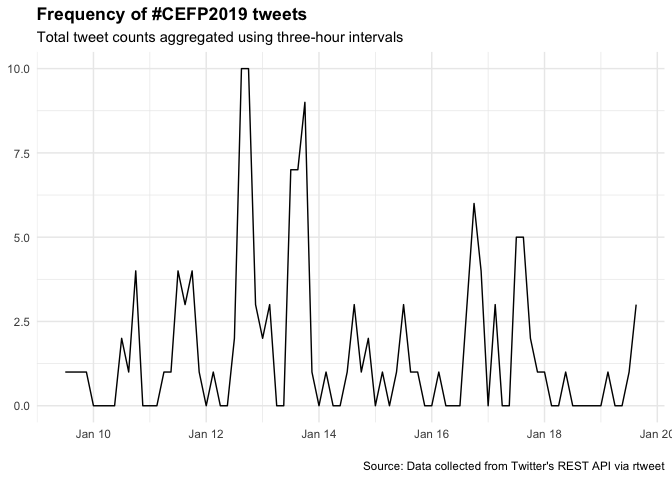

### Basic summary

There were a total of **107** tweets with the \#CEFP2019 hashtag. These
tweets were authored by **26** different particpants.

### The 5 most favorited tweets

<table>
<thead>
<tr class="header">
<th style="text-align: left;">screen_name</th>
<th style="text-align: left;">text</th>
</tr>
</thead>
<tbody>
<tr class="odd">
<td style="text-align: left;">raynamharris</td>
<td style="text-align: left;">This is a cool way to think about the stages conversation within communities. Early stages: one- or two-way conversations (convey and contribute). Later stages: collaboration and co-creation to generate novel ideas &amp; solutions to problems. From @LouWoodley at #CEFP2019 @TheCSCCE <a href="https://t.co/OvOV1SoQ5r" class="uri">https://t.co/OvOV1SoQ5r</a></td>
</tr>
<tr class="even">
<td style="text-align: left;">StefanieButland</td>
<td style="text-align: left;">I’m the luckiest community manager! Mentoring this week for 2019 cohort of AAAS Community Engagement Fellows. I learn from @rOpenSci community, @_inundata @sckottie @ma_salmon @opencpu @RLadiesGlobal @bffo &amp; #CEFP2017 peers. Taking all the goodness back to them #CEFP2019. <a href="https://t.co/ybvfbV8RTX" class="uri">https://t.co/ybvfbV8RTX</a></td>
</tr>
<tr class="odd">
<td style="text-align: left;">serahrono</td>
<td style="text-align: left;">At the end of an impeccable first day at #CEFP2019, and deeply appreciative of, among other things, the time, expertise and experiences that folk from #CEFP2017 have lent us today.</td>
</tr>
<tr class="even">
<td style="text-align: left;">Baker_aquatic</td>
<td style="text-align: left;">Excited to be in Washington for the kick off meeting on community engagement in science @aaas #CEFP2019 #training #learning #newfriends <a href="https://t.co/9nsHEcaaqZ" class="uri">https://t.co/9nsHEcaaqZ</a></td>
</tr>
<tr class="odd">
<td style="text-align: left;">biotechchat</td>
<td style="text-align: left;">We’re here, we’re caffeinated and we’re ready to kick off #CEFP2019! <a href="https://t.co/XJpO9jXrW4" class="uri">https://t.co/XJpO9jXrW4</a></td>
</tr>
</tbody>
</table>

### The 5 most retweeted tweets

<table>
<thead>
<tr class="header">
<th style="text-align: left;">screen_name</th>
<th style="text-align: left;">text</th>
</tr>
</thead>
<tbody>
<tr class="odd">
<td style="text-align: left;">raynamharris</td>
<td style="text-align: left;">This is a cool way to think about the stages conversation within communities. Early stages: one- or two-way conversations (convey and contribute). Later stages: collaboration and co-creation to generate novel ideas &amp; solutions to problems. From @LouWoodley at #CEFP2019 @TheCSCCE <a href="https://t.co/OvOV1SoQ5r" class="uri">https://t.co/OvOV1SoQ5r</a></td>
</tr>
<tr class="even">
<td style="text-align: left;">camisantistevan</td>
<td style="text-align: left;">Day 1 @aaas #CEFP2019: defined community, met our #CEFP2017 mentors, learned about community participation guides, mapped 4 types of scientific communities, heard lightning talks by @Baker_aquatic @quixoticroads @RockyRohde, and drafted community overview statements! Also ☕ &amp;🍕 <a href="https://t.co/ezbvTgsYSH" class="uri">https://t.co/ezbvTgsYSH</a></td>
</tr>
<tr class="odd">
<td style="text-align: left;">ah_bakker</td>
<td style="text-align: left;">First day of #CEFP2019 is a wrap! I met some fantastic people, learned about different kinds of scientific communities, and was inspired by @LouWoodley speaking on different stages of community growth. Eager to continue the conversation tomorrow. <a href="https://t.co/aJpHscDVSX" class="uri">https://t.co/aJpHscDVSX</a></td>
</tr>
<tr class="even">
<td style="text-align: left;">TheCSCCE</td>
<td style="text-align: left;">Meet Kate Baker! She’s a Postdoctoral Research Fellow and Engagement Lead in the Centre for Water Systems at the University of Exeter, UK. You can find the fellows we’re highlighting today here: <a href="https://t.co/bUfG7fMKLB" class="uri">https://t.co/bUfG7fMKLB</a> @Baker_aquatic #CEFP2019 <a href="https://t.co/BpFVQ1I5SN" class="uri">https://t.co/BpFVQ1I5SN</a></td>
</tr>
<tr class="odd">
<td style="text-align: left;">Baker_aquatic</td>
<td style="text-align: left;">.@rhappe @TheCR sharing the community engagement framework- a mechanism to #measure culture change. Comfort ➡️Connection ➡️Trust ➡️Partnership. “Manage the behaviour, not the content” @aaas #CEFP2019 <a href="https://t.co/jXMl3w5ADJ" class="uri">https://t.co/jXMl3w5ADJ</a></td>
</tr>
<tr class="even">
<td style="text-align: left;">serahrono</td>
<td style="text-align: left;">At the end of an impeccable first day at #CEFP2019, and deeply appreciative of, among other things, the time, expertise and experiences that folk from #CEFP2017 have lent us today.</td>
</tr>
</tbody>
</table>

### Which tweeters had the highest impact?

### Acknowledgment

This code was adapted from François Michonneau’s
[code](https://github.com/fmichonneau/2018-carpentrycon-tweets/blob/master/index.Rmd)
that he used to create this [blog post about twitter statistics from
Carpentry Con
2018](https://carpentries.org/2018/06/carpentrycon-tweets). The
[`rtweet` package](https://rtweet.info/) had excellent documentation.
