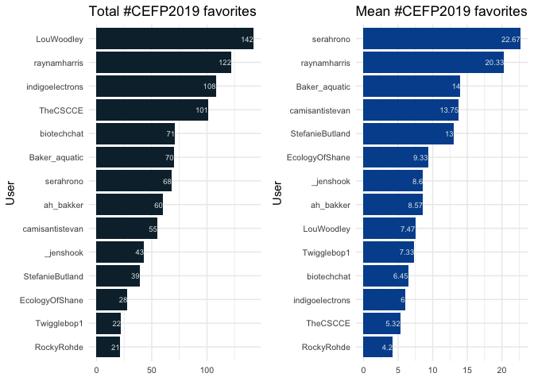

### Basic summary

There were a total of **132** tweets with the \#CEFP2019 hashtag. These
tweets were authored by **28** different particpants.

### The 5 most favorited tweets

<table>
<thead>
<tr class="header">
<th style="text-align: left;">screen_name</th>
<th style="text-align: left;">text</th>
<th style="text-align: right;">favorite_count</th>
</tr>
</thead>
<tbody>
<tr class="odd">
<td style="text-align: left;">raynamharris</td>
<td style="text-align: left;">This is a cool way to think about the stages conversation within communities. Early stages: one- or two-way conversations (convey and contribute). Later stages: collaboration and co-creation to generate novel ideas &amp; solutions to problems. From @LouWoodley at #CEFP2019 @TheCSCCE <a href="https://t.co/OvOV1SoQ5r" class="uri">https://t.co/OvOV1SoQ5r</a></td>
<td style="text-align: right;">57</td>
</tr>
<tr class="even">
<td style="text-align: left;">tracykteal</td>
<td style="text-align: left;">“If you want a hard job become a community manager” @kierisi #rstudioconf Thinking of #CEFP2019! Many people are excited about mentorship &amp; it’s fantastic, but there’s still a need to teach people how to be effective mentors.</td>
<td style="text-align: right;">33</td>
</tr>
<tr class="odd">
<td style="text-align: left;">LouWoodley</td>
<td style="text-align: left;">Go, CEFP! Group photo of #CEFP2019 fellows, mentors from #cefp2017 and @TheCSCCE staff ❤️ <a href="https://t.co/EVTbStHkDS" class="uri">https://t.co/EVTbStHkDS</a></td>
<td style="text-align: right;">32</td>
</tr>
<tr class="even">
<td style="text-align: left;">StefanieButland</td>
<td style="text-align: left;">I’m the luckiest community manager! Mentoring this week for 2019 cohort of AAAS Community Engagement Fellows</td>
<td style="text-align: right;"></td>
</tr>
</tbody>
</table>

I learn from @rOpenSci community, @\_inundata @sckottie @ma\_salmon
@opencpu @RLadiesGlobal @bffo & \#CEFP2017 peers

Taking all the goodness back to them

\#CEFP2019 <https://t.co/ybvfbV8RTX> 31 serahrono At the end of an
impeccable first day at \#CEFP2019, and deeply appreciative of, among
other things, the time, expertise and experiences that folk from
\#CEFP2017 have lent us today. 29 serahrono One of the things I have
picked up from other \#CEFP2019 fellows, and that I absolutely love, is
how important it is to involve and continually ascribe progress and
learnings to members of the community one is embedded in. More ‘we’,
less ‘I’. If only it was spelt ‘commun-WE-ty’. 27 indigoelectrons
There’s a growing body of research showing cultural inclusivity & better
representation of \#WomenInScience increases *success* (big term I
know), as if we needed more reasons to dismantle the current system rife
with inequality. @sondy \#CEFP2019 <https://t.co/U6JJnzHCHy> 26
Baker\_aquatic Excited to be in Washington for the kick off meeting on
community engagement in science @aaas \#CEFP2019 \#training \#learning
\#newfriends <https://t.co/9nsHEcaaqZ> 25 \_jenshook Had so much fun
showing \#CEFP2019 around @InsideNatGeo this week! \#scicommunity So
excited to learn from this crew this year! <https://t.co/wdNhcthsnG> 24
biotechchat We’re here, we’re caffeinated and we’re ready to kick off
\#CEFP2019! <https://t.co/XJpO9jXrW4> 21

### The 5 most retweeted tweets

<table>
<thead>
<tr class="header">
<th style="text-align: left;">screen_name</th>
<th style="text-align: left;">text</th>
<th style="text-align: right;">retweet_count</th>
</tr>
</thead>
<tbody>
<tr class="odd">
<td style="text-align: left;">raynamharris</td>
<td style="text-align: left;">This is a cool way to think about the stages conversation within communities. Early stages: one- or two-way conversations (convey and contribute). Later stages: collaboration and co-creation to generate novel ideas &amp; solutions to problems. From @LouWoodley at #CEFP2019 @TheCSCCE <a href="https://t.co/OvOV1SoQ5r" class="uri">https://t.co/OvOV1SoQ5r</a></td>
<td style="text-align: right;">34</td>
</tr>
<tr class="even">
<td style="text-align: left;">raynamharris</td>
<td style="text-align: left;">Excited to announce the newest @thecarpentries community-driven lesson translation: Análisis y visualización de datos usando Python. Even if you don’t use #python, our blog about how we did it should be useful to folks at #Rstudioconf and #cefp2019.</td>
<td style="text-align: right;"></td>
</tr>
<tr class="odd">
<td style="text-align: left;"><a href="https://t.co/kG4EA" class="uri">https://t.co/kG4EA</a></td>
<td style="text-align: left;">i8eIM 15</td>
<td style="text-align: right;"></td>
</tr>
<tr class="even">
<td style="text-align: left;">indigoelectrons</td>
<td style="text-align: left;">There’s a growing body of research showing cultural inclusivity &amp; better representation of #WomenInScience increases <em>success</em> (big term I know), as if we needed more reasons to dismantle the current system rife with inequality. @sondy #CEFP2019 <a href="https://t.co/U6JJnzHCHy" class="uri">https://t.co/U6JJnzHCHy</a></td>
<td style="text-align: right;">10</td>
</tr>
<tr class="odd">
<td style="text-align: left;">TheCSCCE</td>
<td style="text-align: left;">Meet Ann Meyer! She’s the coordinator for the Canadian Bioinformatics Workshops series (<a href="https://t.co/N2O0wU40bm" class="uri">https://t.co/N2O0wU40bm</a>), the Knowledge and Research Exchange manager at OICR: <a href="https://t.co/wP66u91Juq" class="uri">https://t.co/wP66u91Juq</a> @meyer_ann #CEFP2019 <a href="https://t.co/gdndhxx7Ed" class="uri">https://t.co/gdndhxx7Ed</a></td>
<td style="text-align: right;">8</td>
</tr>
<tr class="even">
<td style="text-align: left;">raynamharris</td>
<td style="text-align: left;">I’m giving a lightning talk today at #CEFP2019 about networking strategies. Comments/feedback for improving the content and this accompanying infographic are welcome! <a href="https://t.co/PmpufWd6VC" class="uri">https://t.co/PmpufWd6VC</a> #CommunityEngagement #CommonsPilot <a href="https://t.co/vTFOOhJFpf" class="uri">https://t.co/vTFOOhJFpf</a></td>
<td style="text-align: right;">7</td>
</tr>
</tbody>
</table>

### Which tweeters had the highest impact?

### Acknowledgments

My [source
code](https://github.com/raynamharris/cefp2019/blob/master/dataviz/rtweets_CEFP2019.Rmd)
was adapted from François Michonneau’s
[code](https://github.com/fmichonneau/2018-carpentrycon-tweets/blob/master/index.Rmd)
that he used to create this [blog post about twitter statistics from
Carpentry Con
2018](https://carpentries.org/2018/06/carpentrycon-tweets). The
[`rtweet` package](https://rtweet.info/) had excellent documentation. I
used [Image Color Picker](https://imagecolorpicker.com/) to obtain hex
color codes following the CEFP color palette.
