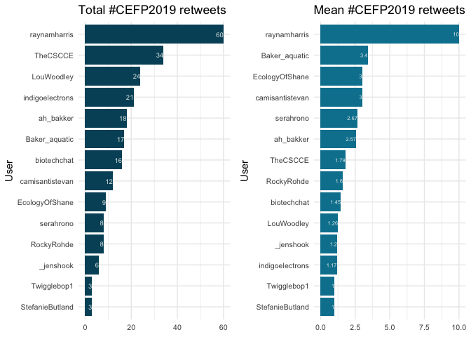

### Basic summary

There were a total of **132** tweets with the \#CEFP2019 hashtag. These
tweets were authored by **29** different particpants.

### The 5 most favorited tweets

<table>
<thead>
<tr class="header">
<th style="text-align: left;">screen_name</th>
<th style="text-align: left;">text</th>
<th style="text-align: right;">favorite_count</th>
</tr>
</thead>
<tbody>
<tr class="odd">
<td style="text-align: left;">raynamharris</td>
<td style="text-align: left;">This is a cool way to think about the stages conversation within communities. Early stages: one- or two-way conversations (convey and contribute). Later stages: collaboration and co-creation to generate novel ideas &amp; solutions to problems. From @LouWoodley at #CEFP2019 @TheCSCCE <a href="https://t.co/OvOV1SoQ5r" class="uri">https://t.co/OvOV1SoQ5r</a></td>
<td style="text-align: right;">57</td>
</tr>
<tr class="even">
<td style="text-align: left;">StefanieButland</td>
<td style="text-align: left;">I’m the luckiest community manager! Mentoring this week for 2019 cohort of AAAS Community Engagement Fellows. I learn from @rOpenSci community, @_inundata @sckottie @ma_salmon @opencpu @RLadiesGlobal @bffo &amp; #CEFP2017 peers. Taking all the goodness back to them #CEFP2019. <a href="https://t.co/ybvfbV8RTX" class="uri">https://t.co/ybvfbV8RTX</a></td>
<td style="text-align: right;">31</td>
</tr>
<tr class="odd">
<td style="text-align: left;">serahrono</td>
<td style="text-align: left;">At the end of an impeccable first day at #CEFP2019, and deeply appreciative of, among other things, the time, expertise and experiences that folk from #CEFP2017 have lent us today.</td>
<td style="text-align: right;">29</td>
</tr>
<tr class="even">
<td style="text-align: left;">indigoelectrons</td>
<td style="text-align: left;">There’s a growing body of research showing cultural inclusivity &amp; better representation of #WomenInScience increases <em>success</em> (big term I know), as if we needed more reasons to dismantle the current system rife with inequality. @sondy #CEFP2019 <a href="https://t.co/U6JJnzHCHy" class="uri">https://t.co/U6JJnzHCHy</a></td>
<td style="text-align: right;">26</td>
</tr>
<tr class="odd">
<td style="text-align: left;">LouWoodley</td>
<td style="text-align: left;">Go, CEFP! Group photo of #CEFP2019 fellows, mentors from #cefp2017 and @TheCSCCE staff ❤️ <a href="https://t.co/EVTbStHkDS" class="uri">https://t.co/EVTbStHkDS</a></td>
<td style="text-align: right;">25</td>
</tr>
<tr class="even">
<td style="text-align: left;">Baker_aquatic</td>
<td style="text-align: left;">Excited to be in Washington for the kick off meeting on community engagement in science @aaas #CEFP2019 #training #learning #newfriends <a href="https://t.co/9nsHEcaaqZ" class="uri">https://t.co/9nsHEcaaqZ</a></td>
<td style="text-align: right;">25</td>
</tr>
<tr class="odd">
<td style="text-align: left;">biotechchat</td>
<td style="text-align: left;">We’re here, we’re caffeinated and we’re ready to kick off #CEFP2019! <a href="https://t.co/XJpO9jXrW4" class="uri">https://t.co/XJpO9jXrW4</a></td>
<td style="text-align: right;">21</td>
</tr>
<tr class="even">
<td style="text-align: left;">serahrono</td>
<td style="text-align: left;">One of the things I have picked up from other #CEFP2019 fellows, and that I absolutely love, is how important it is to involve and continually ascribe progress and learnings to members of the community one is embedded in. More ‘we’, less ‘I’. If only it was spelt ‘commun-WE-ty’.</td>
<td style="text-align: right;">20</td>
</tr>
<tr class="odd">
<td style="text-align: left;">raynamharris</td>
<td style="text-align: left;">I made it to DC for #CEFP2019 training! But first, I took @serahrono to see @therevivalists. Nothing like a little live music to kickstart a new @thecarpentries relationship. #allmyfriendstakegoodcareofme <a href="https://t.co/NbpQ6PVy9Y" class="uri">https://t.co/NbpQ6PVy9Y</a></td>
<td style="text-align: right;">19</td>
</tr>
<tr class="even">
<td style="text-align: left;">camisantistevan</td>
<td style="text-align: left;">Let’s get to work! @aaas #CEFP2019 <a href="https://t.co/jwoNSzuHAt" class="uri">https://t.co/jwoNSzuHAt</a></td>
<td style="text-align: right;">19</td>
</tr>
</tbody>
</table>

### The 5 most retweeted tweets

<table>
<thead>
<tr class="header">
<th style="text-align: left;">screen_name</th>
<th style="text-align: left;">text</th>
<th style="text-align: right;">retweet_count</th>
</tr>
</thead>
<tbody>
<tr class="odd">
<td style="text-align: left;">raynamharris</td>
<td style="text-align: left;">This is a cool way to think about the stages conversation within communities. Early stages: one- or two-way conversations (convey and contribute). Later stages: collaboration and co-creation to generate novel ideas &amp; solutions to problems. From @LouWoodley at #CEFP2019 @TheCSCCE <a href="https://t.co/OvOV1SoQ5r" class="uri">https://t.co/OvOV1SoQ5r</a></td>
<td style="text-align: right;">34</td>
</tr>
<tr class="even">
<td style="text-align: left;">indigoelectrons</td>
<td style="text-align: left;">There’s a growing body of research showing cultural inclusivity &amp; better representation of #WomenInScience increases <em>success</em> (big term I know), as if we needed more reasons to dismantle the current system rife with inequality. @sondy #CEFP2019 <a href="https://t.co/U6JJnzHCHy" class="uri">https://t.co/U6JJnzHCHy</a></td>
<td style="text-align: right;">10</td>
</tr>
<tr class="odd">
<td style="text-align: left;">raynamharris</td>
<td style="text-align: left;">I’m giving a lightning talk today at #CEFP2019 about networking strategies. Comments/feedback for improving the content and this accompanying infographic are welcome! <a href="https://t.co/PmpufWd6VC" class="uri">https://t.co/PmpufWd6VC</a> #CommunityEngagement #CommonsPilot <a href="https://t.co/vTFOOhJFpf" class="uri">https://t.co/vTFOOhJFpf</a></td>
<td style="text-align: right;">7</td>
</tr>
<tr class="even">
<td style="text-align: left;">TheCSCCE</td>
<td style="text-align: left;">Meet Ann Meyer! She’s the coordinator for the Canadian Bioinformatics Workshops series (<a href="https://t.co/N2O0wU40bm" class="uri">https://t.co/N2O0wU40bm</a>), the Knowledge and Research Exchange manager at OICR: <a href="https://t.co/wP66u91Juq" class="uri">https://t.co/wP66u91Juq</a> @meyer_ann #CEFP2019 <a href="https://t.co/gdndhxx7Ed" class="uri">https://t.co/gdndhxx7Ed</a></td>
<td style="text-align: right;">7</td>
</tr>
<tr class="odd">
<td style="text-align: left;">LouWoodley</td>
<td style="text-align: left;">Go, CEFP! Group photo of #CEFP2019 fellows, mentors from #cefp2017 and @TheCSCCE staff ❤️ <a href="https://t.co/EVTbStHkDS" class="uri">https://t.co/EVTbStHkDS</a></td>
<td style="text-align: right;">6</td>
</tr>
<tr class="even">
<td style="text-align: left;">ah_bakker</td>
<td style="text-align: left;">First day of #CEFP2019 is a wrap! I met some fantastic people, learned about different kinds of scientific communities, and was inspired by @LouWoodley speaking on different stages of community growth. Eager to continue the conversation tomorrow. <a href="https://t.co/aJpHscDVSX" class="uri">https://t.co/aJpHscDVSX</a></td>
<td style="text-align: right;">6</td>
</tr>
<tr class="odd">
<td style="text-align: left;">EcologyOfShane</td>
<td style="text-align: left;">Had a really great convo about #impostersyndrome today at #CEFP2019. Reminded me of my own version via #science #FOMO <a href="https://t.co/A3um6yTNUC" class="uri">https://t.co/A3um6yTNUC</a> @storycollider #scicomm #storytelling <a href="https://t.co/TUS55a0l33" class="uri">https://t.co/TUS55a0l33</a></td>
<td style="text-align: right;">6</td>
</tr>
<tr class="even">
<td style="text-align: left;">camisantistevan</td>
<td style="text-align: left;">Day 1 @aaas #CEFP2019: defined community, met our #CEFP2017 mentors, learned about community participation guides, mapped 4 types of scientific communities, heard lightning talks by @Baker_aquatic @quixoticroads @RockyRohde, and drafted community overview statements! Also ☕ &amp;🍕 <a href="https://t.co/ezbvTgsYSH" class="uri">https://t.co/ezbvTgsYSH</a></td>
<td style="text-align: right;">6</td>
</tr>
<tr class="odd">
<td style="text-align: left;">TheCSCCE</td>
<td style="text-align: left;">Meet Kate Baker! She’s a Postdoctoral Research Fellow and Engagement Lead in the Centre for Water Systems at the University of Exeter, UK. You can find the fellows we’re highlighting today here: <a href="https://t.co/bUfG7fMKLB" class="uri">https://t.co/bUfG7fMKLB</a> @Baker_aquatic #CEFP2019 <a href="https://t.co/BpFVQ1I5SN" class="uri">https://t.co/BpFVQ1I5SN</a></td>
<td style="text-align: right;">6</td>
</tr>
</tbody>
</table>

### Which tweeters had the highest impact?

### Acknowledgments

My [source
code](https://github.com/raynamharris/cefp2019/blob/master/dataviz/rtweets_CEFP2019.Rmd)
was adapted from François Michonneau’s
[code](https://github.com/fmichonneau/2018-carpentrycon-tweets/blob/master/index.Rmd)
that he used to create this [blog post about twitter statistics from
Carpentry Con
2018](https://carpentries.org/2018/06/carpentrycon-tweets). The
[`rtweet` package](https://rtweet.info/) had excellent documentation. I
used [Image Color Picker](https://imagecolorpicker.com/) to obtain hex
color codes following the CEFP color palette.
