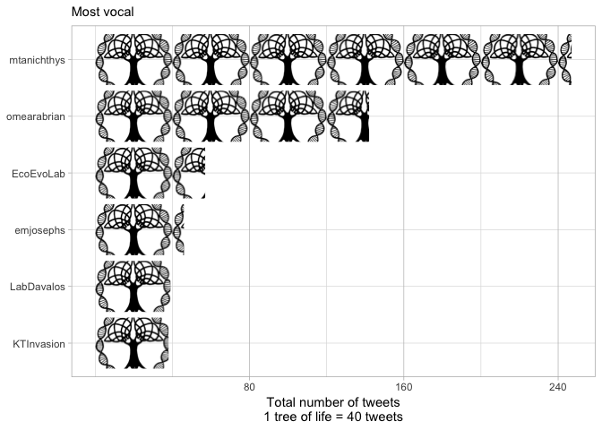
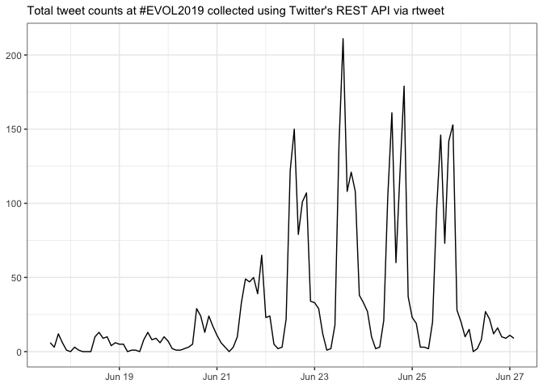
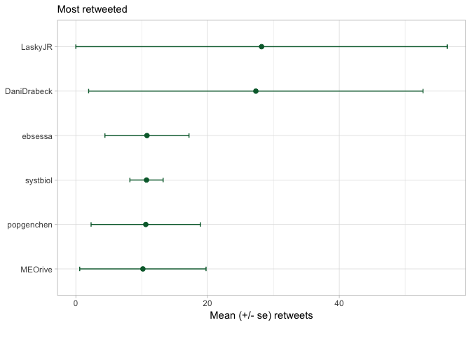
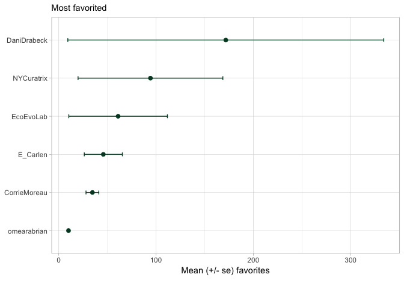
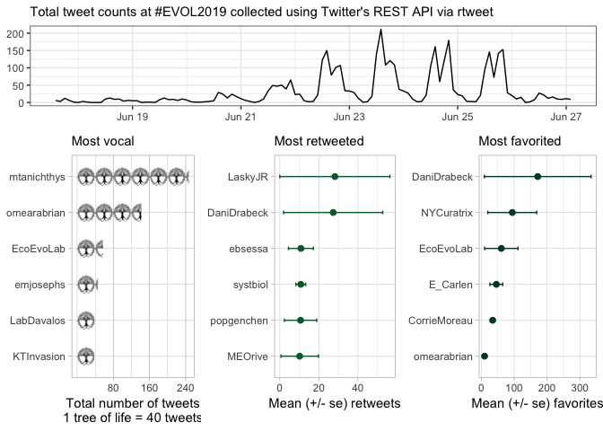

    ## load packages
    #install.packages("plotrix")
    library(rtweet) # for fetching twitter data
    library(dplyr) # for filter and select
    library(tidyr) # for gather function
    library(knitr) # for pretty tables
    library(ggplot2) # for plotting
    library("plotrix") # for std error
    library("cowplot") # for doubble figures
    library("ggtextures") 

    # set default code output to False
    knitr::opts_chunk$set(echo = T)

    # set figure directory
    knitr::opts_chunk$set(fig.path = 'rtweets_EVOL2019_figs/')

    ## first, follow steps in <https://rtweet.info/> to setup API and relevant tokens

    ## search for 18000 tweets using the rstats hashtag
    rt <- search_tweets(
      "EVOL2019 OR EVOL19 ", n = 4000, include_rts = FALSE, type = "mixed"
    )

### Basic summary

There were a total of **3725** tweets with the EVOL hashtag. These
tweets were authored by **798** different particpants.

    top_users <- rt %>%
        group_by(screen_name) %>%
        summarize(total_tweets = n()) %>%
      filter(total_tweets > 36) %>%
      arrange(total_tweets)  %>% 
      mutate(image = "https://cdn.pixabay.com/photo/2018/02/05/16/29/tree-of-life-3132592_960_720.png")  %>% 
      mutate(partials = total_tweets / 40)
    top_users

    ## # A tibble: 6 x 4
    ##   screen_name total_tweets image                                   partials
    ##   <chr>              <int> <chr>                                      <dbl>
    ## 1 KTInvasion            38 https://cdn.pixabay.com/photo/2018/02/…    0.95 
    ## 2 LabDavalos            39 https://cdn.pixabay.com/photo/2018/02/…    0.975
    ## 3 emjosephs             46 https://cdn.pixabay.com/photo/2018/02/…    1.15 
    ## 4 EcoEvoLab             57 https://cdn.pixabay.com/photo/2018/02/…    1.42 
    ## 5 omearabrian          142 https://cdn.pixabay.com/photo/2018/02/…    3.55 
    ## 6 mtanichthys          247 https://cdn.pixabay.com/photo/2018/02/…    6.18

    a <- ggplot(top_users, aes(reorder(screen_name, total_tweets), partials, image = image)) +
      geom_isotype_col(
        img_width = grid::unit(1, "native"), img_height = NULL,
        ncol = NA, nrow = 1, hjust = 0, vjust = 0.5
      ) +
      scale_y_continuous(breaks = c(2,  4,  6),
                         label = c( "80",  "160", "240")) +
      coord_flip() +
      theme_light() +
      #theme(axis.text = element_text(size = 8),
      #legend.text = element_text(size = 8)) + 
      labs(x = NULL, y = "Total number of tweets\n1 tree of life = 40 tweets",
        subtitle  = "Most vocal") + 
      theme(panel.grid.major.x = element_line(colour = "grey"),
            panel.grid.minor.x = element_line(colour = "grey"))

    a

    # tweet timeline
    top <- ts_plot(rt, "2 hours") +
      ggplot2::theme_bw() +
      ggplot2::theme(plot.title = ggplot2::element_text(face = "bold")) +
      ggplot2::labs(
        x = NULL, y = NULL,
        subtitle = "Total tweet counts at #EVOL2019 collected using Twitter's REST API via rtweet"
      )

    top

### top 6 favs

    top5favs <- rt %>%
      top_n(5, favorite_count) %>%
      arrange(desc(favorite_count)) %>%
      select(screen_name)
    head(top5favs)

A tibble: 5 x 1
===============

screen\_name  
<chr>  
1 EcoEvoLab  
2 NYCuratrix  
3 DaniDrabeck  
4 maggie\_schedl 5 sexchrlab

### top 6 retweets

    topretweets <- rt %>%
      top_n(5, retweet_count) %>%
      arrange(desc(retweet_count)) %>%
      select(screen_name)
    head(topretweets)

A tibble: 5 x 1
===============

screen\_name <chr>  
1 EcoEvoLab  
2 popgenchen  
3 butch\_brodie 4 DaniDrabeck 5 LaskyJR

### Which tweeters had the highest impact?

    impact <- rt %>%
        group_by(screen_name) %>%
        summarize(n_tweets = n(),
                  n_fav = sum(favorite_count),
                  n_rt =  sum(retweet_count),
                  mean_fav = round(mean(favorite_count), digits = 2),
                  mean_rt = round(mean(retweet_count), digits = 2),
                  se_fav = std.error(favorite_count),
                  se_rt = std.error(retweet_count)) %>%
        filter(n_tweets >=  5) %>%
        arrange(-n_tweets)
    head(impact)

    ## # A tibble: 6 x 8
    ##   screen_name n_tweets n_fav  n_rt mean_fav mean_rt se_fav  se_rt
    ##   <chr>          <int> <int> <int>    <dbl>   <dbl>  <dbl>  <dbl>
    ## 1 mtanichthys      247   329   103     1.33    0.42  0.244 0.0631
    ## 2 omearabrian      142  1427   402    10.0     2.83  1.26  0.401 
    ## 3 EcoEvoLab         57  3477   305    61       5.35 50.7   4.45  
    ## 4 emjosephs         46   358   124     7.78    2.7   1.85  1.91  
    ## 5 LabDavalos        39   139    34     3.56    0.87  0.716 0.241 
    ## 6 KTInvasion        38   197    44     5.18    1.16  0.812 0.326

    #head(impact)

### Which tweeters had the most retweets?

    mean_rt <- impact %>%
        top_n(6, mean_rt)
    mean_rt$screen_name <- reorder(mean_rt$screen_name,
                                  mean_rt$mean_rt,
                                  sort)
    head(mean_rt)

    ## # A tibble: 6 x 8
    ##   screen_name n_tweets n_fav  n_rt mean_fav mean_rt se_fav se_rt
    ##   <fct>          <int> <int> <int>    <dbl>   <dbl>  <dbl> <dbl>
    ## 1 popgenchen        21   349   223     16.6    10.6   5.62  8.30
    ## 2 systbiol          15   385   161     25.7    10.7   6.75  2.52
    ## 3 MEOrive           11   437   112     39.7    10.2  28.9   9.59
    ## 4 DaniDrabeck        6  1030   164    172.     27.3 162.   25.4 
    ## 5 ebsessa            5   244    54     48.8    10.8  16.5   6.38
    ## 6 LaskyJR            5    88   141     17.6    28.2  14.9  28.2

    b2 <- mean_rt  %>% 
      ggplot(aes(x= screen_name, y = mean_rt, 
                 stat = "identity")) + 
        geom_errorbar(aes(ymin=mean_rt-se_rt, ymax=mean_rt+se_rt), width=.1, color="#006837") +
        geom_point(size = 2,  color="#006837") +
        coord_flip() + 
        theme_light() +
      labs(y = "Mean (+/- se) retweets\n ", x = NULL,
        subtitle  = "Most retweeted") 
    b2

### Which tweeters had the most favorites?

    most_fav <- impact %>%
        top_n(6, n_fav)
    most_fav$screen_name <- reorder(most_fav$screen_name,
                                  most_fav$mean_fav,
                                  sort)

    head(most_fav)

    ## # A tibble: 6 x 8
    ##   screen_name  n_tweets n_fav  n_rt mean_fav mean_rt se_fav  se_rt
    ##   <fct>           <int> <int> <int>    <dbl>   <dbl>  <dbl>  <dbl>
    ## 1 omearabrian       142  1427   402     10.0    2.83   1.26  0.401
    ## 2 EcoEvoLab          57  3477   305     61      5.35  50.7   4.45 
    ## 3 CorrieMoreau       25   865   130     34.6    5.2    6.59  0.998
    ## 4 E_Carlen           16   733   101     45.8    6.31  19.6   3.46 
    ## 5 NYCuratrix         16  1508    83     94.2    5.19  74.4   4.34 
    ## 6 DaniDrabeck         6  1030   164    172.    27.3  162.   25.4

    most_fav

    ## # A tibble: 6 x 8
    ##   screen_name  n_tweets n_fav  n_rt mean_fav mean_rt se_fav  se_rt
    ##   <fct>           <int> <int> <int>    <dbl>   <dbl>  <dbl>  <dbl>
    ## 1 omearabrian       142  1427   402     10.0    2.83   1.26  0.401
    ## 2 EcoEvoLab          57  3477   305     61      5.35  50.7   4.45 
    ## 3 CorrieMoreau       25   865   130     34.6    5.2    6.59  0.998
    ## 4 E_Carlen           16   733   101     45.8    6.31  19.6   3.46 
    ## 5 NYCuratrix         16  1508    83     94.2    5.19  74.4   4.34 
    ## 6 DaniDrabeck         6  1030   164    172.    27.3  162.   25.4

    d2 <- most_fav  %>% 
      ggplot(aes( x = screen_name, y = mean_fav, 
                 stat = "identity")) + 
        geom_errorbar(aes(ymin=mean_fav-se_fav, ymax=mean_fav+se_fav), width=.1, color="#004529") +
        geom_point(size = 2, color="#004529") +
        coord_flip() + 
        theme_light() +
      labs(y = "Mean (+/- se) favorites\n ", x = NULL,
        subtitle  = "Most favorited")
    d2

    bottom <- plot_grid(a,b2,d2, nrow = 1)

    plot_grid(top,bottom, nrow = 2, rel_heights = c(0.3,0.7))

    ggsave("~/Desktop/asm.png", plot = last_plot(), device = NULL, path = NULL,
      scale = 1, width = 8, height = 4,
      dpi = 300)

### Acknowledgments

My [source
code](https://github.com/raynamharris/cefp2019/blob/master/dataviz/rtweets_EVOL2019.Rmd)
was adapted from François Michonneau’s
[code](https://github.com/fmichonneau/2018-carpentrycon-tweets/blob/master/index.Rmd)
that he used to create this [blog post about twitter statistics from
Carpentry Con
2018](https://carpentries.org/2018/06/carpentrycon-tweets). The
[`rtweet` package](https://rtweet.info/) had excellent documentation.
