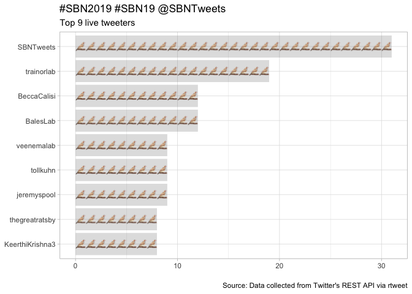
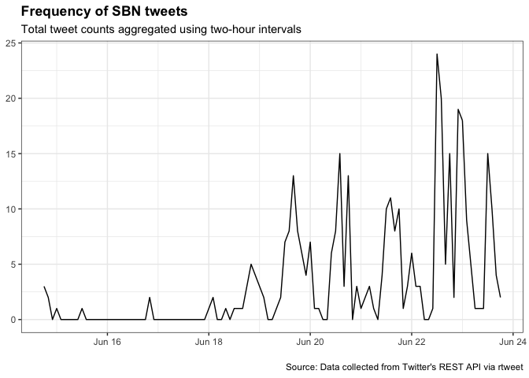
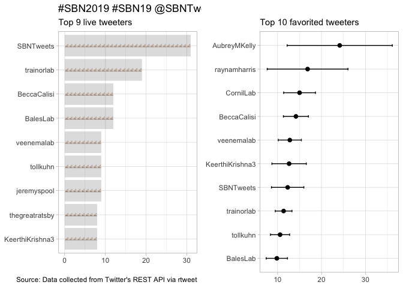

### Basic summary

There were a total of **325** tweets with the SBN hashtag. These tweets
were authored by **111** different particpants.

    ## # A tibble: 6 x 3
    ##   screen_name    total_tweets image                                        
    ##   <chr>                 <int> <chr>                                        
    ## 1 KeerthiKrishn…            8 https://library.kissclipart.com/20180830/jw/…
    ## 2 thegreatratsby            8 https://library.kissclipart.com/20180830/jw/…
    ## 3 jeremyspool               9 https://library.kissclipart.com/20180830/jw/…
    ## 4 tollkuhn                  9 https://library.kissclipart.com/20180830/jw/…
    ## 5 veenemalab                9 https://library.kissclipart.com/20180830/jw/…
    ## 6 BalesLab                 12 https://library.kissclipart.com/20180830/jw/…

top 6 favs
==========

A tibble: 5 x 3
===============

screen\_name text favorite\_count <chr> <chr> <int> 1 SBNTweets
Congratulations to Elizabeth Adkins-Regan, w… 110 2 AubreyMKelly
Interested in bizarre animals that defy expe… 71 3 AubreyMKelly Looks
like I’ll be presenting the world’s ti… 67 4 raynamharris "I’m
presenting a poster today at @SBNTweet… 62 5 SBNTweets Welcome to
@amandakrentzel and @wmkenkel, ou… 53

top 6 retweets
==============

A tibble: 6 x 3
===============

screen\_name text retweet\_count <chr> <chr> <int> 1 raynamharris "I’m
presenting a poster today at @SBNTweets… 20 2 SBNTweets Congratulations
to Elizabeth Adkins-Regan, wi… 19 3 BeccaCalisi Doing something new at
\#SBN2019 @SBNTweets by… 14 4 wmkenkel Hey \#SBN19 are you interested in
sex differen… 10 5 trainorlab Today’s contributed talks session had
amazing… 8 6 AubreyMKelly Interested in bizarre animals that defy expec…
8

### Which tweeters had the highest impact?

    ## # A tibble: 6 x 8
    ##   screen_name n_tweets n_fav  n_rt mean_fav mean_rt se_fav se_rt
    ##   <chr>          <int> <int> <int>    <dbl>   <dbl>  <dbl> <dbl>
    ## 1 SBNTweets         31   381    51    12.3    1.65    3.69 0.611
    ## 2 trainorlab        19   216    39    11.4    2.05    1.90 0.498
    ## 3 BalesLab          12   118     7     9.83   0.580   2.42 0.260
    ## 4 BeccaCalisi       12   170    32    14.2    2.67    2.85 1.16 
    ## 5 jeremyspool        9    74     5     8.22   0.56    2.78 0.377
    ## 6 tollkuhn           9    95    20    10.6    2.22    2.18 0.401

### Acknowledgments

My [source
code](https://github.com/raynamharris/cefp2019/blob/master/dataviz/rtweets_SBN2019.Rmd)
was adapted from François Michonneau’s
[code](https://github.com/fmichonneau/2018-carpentrycon-tweets/blob/master/index.Rmd)
that he used to create this [blog post about twitter statistics from
Carpentry Con
2018](https://carpentries.org/2018/06/carpentrycon-tweets). The
[`rtweet` package](https://rtweet.info/) had excellent documentation.
