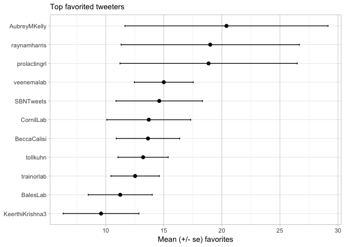

### Basic summary

There were a total of **325** tweets with the SBN hashtag. These tweets
were authored by **111** different particpants.

### top 6 favs

A tibble: 5 x 1
===============

screen\_name <chr>  
1 SBNTweets  
2 AubreyMKelly 3 AubreyMKelly 4 raynamharris 5 SBNTweets

### top 6 retweets

A tibble: 6 x 1
===============

screen\_name <chr>  
1 raynamharris 2 SBNTweets  
3 BeccaCalisi 4 wmkenkel  
5 trainorlab  
6 AubreyMKelly

### Which tweeters had the highest impact?

    ## # A tibble: 6 x 8
    ##   screen_name n_tweets n_fav  n_rt mean_fav mean_rt se_fav se_rt
    ##   <chr>          <int> <int> <int>    <dbl>   <dbl>  <dbl> <dbl>
    ## 1 SBNTweets         31   381    51    12.3    1.65    3.69 0.611
    ## 2 trainorlab        19   216    39    11.4    2.05    1.90 0.498
    ## 3 BalesLab          12   118     7     9.83   0.580   2.42 0.260
    ## 4 BeccaCalisi       12   170    32    14.2    2.67    2.85 1.16 
    ## 5 jeremyspool        9    74     5     8.22   0.56    2.78 0.377
    ## 6 tollkuhn           9    95    20    10.6    2.22    2.18 0.401

### Which tweeters had the most retweets?

    ## # A tibble: 6 x 8
    ##   screen_name     n_tweets n_fav  n_rt mean_fav mean_rt se_fav se_rt
    ##   <fct>              <int> <int> <int>    <dbl>   <dbl>  <dbl> <dbl>
    ## 1 SBNTweets             31   381    51     12.3    1.65   3.69 0.611
    ## 2 trainorlab            19   216    39     11.4    2.05   1.90 0.498
    ## 3 BeccaCalisi           12   170    32     14.2    2.67   2.85 1.16 
    ## 4 tollkuhn               9    95    20     10.6    2.22   2.18 0.401
    ## 5 KeerthiKrishna3        8   101    16     12.6    2      3.91 0.732
    ## 6 LayoDana               7    63    14      9      2      3.22 0.873

### Which tweeters had the most favorites?

    ## # A tibble: 6 x 8
    ##   screen_name n_tweets n_fav  n_rt mean_fav mean_rt se_fav se_rt
    ##   <fct>          <int> <int> <int>    <dbl>   <dbl>  <dbl> <dbl>
    ## 1 SBNTweets         31   381    51    12.3    1.65    3.69 0.611
    ## 2 trainorlab        19   216    39    11.4    2.05    1.90 0.498
    ## 3 BalesLab          12   118     7     9.83   0.580   2.42 0.260
    ## 4 BeccaCalisi       12   170    32    14.2    2.67    2.85 1.16 
    ## 5 tollkuhn           9    95    20    10.6    2.22    2.18 0.401
    ## 6 veenemalab         9   115     3    12.8    0.33    2.63 0.236

### Acknowledgments

My [source
code](https://github.com/raynamharris/cefp2019/blob/master/dataviz/rtweets_SBN2019.Rmd)
was adapted from François Michonneau’s
[code](https://github.com/fmichonneau/2018-carpentrycon-tweets/blob/master/index.Rmd)
that he used to create this [blog post about twitter statistics from
Carpentry Con
2018](https://carpentries.org/2018/06/carpentrycon-tweets). The
[`rtweet` package](https://rtweet.info/) had excellent documentation.
