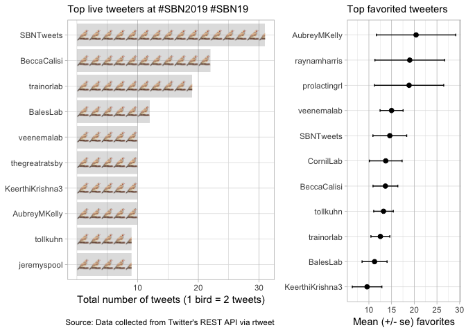

    ## load packages
    #install.packages("plotrix")
    library(rtweet) # for fetching twitter data
    library(dplyr) # for filter and select
    library(tidyr) # for gather function
    library(knitr) # for pretty tables
    library(ggplot2) # for plotting
    library("plotrix") # for std error
    library("cowplot") # for doubble figures
    library("ggtextures") 

    # set default code output to False
    knitr::opts_chunk$set(echo = T)

    # set figure directory
    knitr::opts_chunk$set(fig.path = 'rtweets_SBN2019_figs/')

    ## first, follow steps in <https://rtweet.info/> to setup API and relevant tokens

    ## search for 18000 tweets using the rstats hashtag
    rt <- search_tweets(
      "sbn2019 OR sbn19 OR sbntweets ", n = 1000, include_rts = FALSE, type = "mixed"
    )

### Basic summary

There were a total of **357** tweets with the SBN hashtag. These tweets
were authored by **115** different particpants.

    top_users <- rt %>%
        group_by(screen_name) %>%
        summarize(total_tweets = n()) %>%
      filter(total_tweets > 7) %>%
      arrange(total_tweets)  %>% 
      mutate(image = "https://cdn.pixabay.com/photo/2012/05/02/22/09/bird-46482_960_720.png")  %>% 
      mutate(partials = total_tweets / 2)

    a <- ggplot(top_users, aes(reorder(screen_name, total_tweets), partials, image = image)) +
      geom_isotype_col(
        img_width = grid::unit(1, "native"), img_height = NULL,
        ncol = NA, nrow = 1, hjust = 0, vjust = 0.5, fill = "#80808040"
      ) +
      scale_y_continuous(breaks = c(5, 10, 15),
                         label = c("10", "20", "30")) +
      coord_flip() +
      theme_light() +
      #theme(axis.text = element_text(size = 8),
      #legend.text = element_text(size = 8)) + 
      labs(x = NULL, y = "Total number of tweets",
        subtitle  = "Top live tweeters at #SBN2019 #SBN19",
        caption = "\nSource: Data collected from Twitter's REST API via rtweet")

    a

    # tweet timeline
    ts_plot(rt, "2 hours") +
      ggplot2::theme_bw() +
      ggplot2::theme(plot.title = ggplot2::element_text(face = "bold")) +
      ggplot2::labs(
        x = NULL, y = NULL,
        title = "Frequency of SBN tweets",
        subtitle = "Total tweet counts aggregated using two-hour intervals",
        caption = "\nSource: Data collected from Twitter's REST API via rtweet"
      )

### top 6 favs

    top5favs <- rt %>%
      top_n(5, favorite_count) %>%
      arrange(desc(favorite_count)) %>%
      select(screen_name)
    head(top5favs)

A tibble: 5 x 1
===============

screen\_name  
<chr>  
1 SBNTweets  
2 AubreyMKelly 3 AubreyMKelly 4 raynamharris 5 DrGlitterbear

### top 6 retweets

    topretweets <- rt %>%
      top_n(5, retweet_count) %>%
      arrange(desc(retweet_count)) %>%
      select(screen_name)
    head(topretweets)

A tibble: 6 x 1
===============

screen\_name <chr>  
1 raynamharris 2 SBNTweets  
3 BeccaCalisi 4 wmkenkel  
5 AubreyMKelly 6 trainorlab

### Which tweeters had the highest impact?

    impact <- rt %>%
        group_by(screen_name) %>%
        summarize(n_tweets = n(),
                  n_fav = sum(favorite_count),
                  n_rt =  sum(retweet_count),
                  mean_fav = round(mean(favorite_count), digits = 2),
                  mean_rt = round(mean(retweet_count), digits = 2),
                  se_fav = std.error(favorite_count),
                  se_rt = std.error(retweet_count)) %>%
        filter(n_tweets >=  5) %>%
        arrange(-n_tweets)
    head(impact)

    ## # A tibble: 6 x 8
    ##   screen_name  n_tweets n_fav  n_rt mean_fav mean_rt se_fav se_rt
    ##   <chr>           <int> <int> <int>    <dbl>   <dbl>  <dbl> <dbl>
    ## 1 SBNTweets          31   430    55     13.9    1.77   3.69 0.615
    ## 2 BeccaCalisi        19   235    35     12.4    1.84   2.52 0.810
    ## 3 trainorlab         19   229    42     12.0    2.21   1.98 0.481
    ## 4 BalesLab           12   132     8     11      0.67   2.63 0.256
    ## 5 AubreyMKelly       10   180    12     18      1.2    8.76 0.786
    ## 6 veenemalab         10   140     3     14      0.3    2.29 0.213

    #head(impact)

### Which tweeters had the most retweets?

    mean_rt <- impact %>%
        top_n(10, mean_rt)
    mean_rt$screen_name <- reorder(mean_rt$screen_name,
                                  mean_rt$mean_rt,
                                  sort)
    head(mean_rt)

    ## # A tibble: 6 x 8
    ##   screen_name     n_tweets n_fav  n_rt mean_fav mean_rt se_fav se_rt
    ##   <fct>              <int> <int> <int>    <dbl>   <dbl>  <dbl> <dbl>
    ## 1 SBNTweets             31   430    55     13.9    1.77   3.69 0.615
    ## 2 BeccaCalisi           19   235    35     12.4    1.84   2.52 0.810
    ## 3 trainorlab            19   229    42     12.0    2.21   1.98 0.481
    ## 4 tollkuhn               9   114    23     12.7    2.56   2.09 0.503
    ## 5 KeerthiKrishna3        8   109    16     13.6    2      3.93 0.732
    ## 6 CornilLab              7    95    13     13.6    1.86   3.48 0.553

    b2 <- mean_rt  %>% 
      ggplot(aes(x= screen_name, y = mean_rt, 
                 stat = "identity")) + 
        geom_errorbar(aes(ymin=mean_rt-se_rt, ymax=mean_rt+se_rt), width=.1) +
        geom_point(size = 2) +
        coord_flip() + 
        geom_text(aes(label = mean_rt, y = mean_rt, x = screen_name),  
                hjust=1, size = 2.5, color = "#E1E9E8") +
        theme_light() +

      labs(x = NULL, y = NULL,
        subtitle = "Highest mean RTs ") 
    b2

### Which tweeters had the most favorites?

    most_fav <- impact %>%
        top_n(10, n_fav)
    most_fav$screen_name <- reorder(most_fav$screen_name,
                                  most_fav$mean_fav,
                                  sort)

    head(most_fav)

    ## # A tibble: 6 x 8
    ##   screen_name  n_tweets n_fav  n_rt mean_fav mean_rt se_fav se_rt
    ##   <fct>           <int> <int> <int>    <dbl>   <dbl>  <dbl> <dbl>
    ## 1 SBNTweets          31   430    55     13.9    1.77   3.69 0.615
    ## 2 BeccaCalisi        19   235    35     12.4    1.84   2.52 0.810
    ## 3 trainorlab         19   229    42     12.0    2.21   1.98 0.481
    ## 4 BalesLab           12   132     8     11      0.67   2.63 0.256
    ## 5 AubreyMKelly       10   180    12     18      1.2    8.76 0.786
    ## 6 veenemalab         10   140     3     14      0.3    2.29 0.213

    d2 <- most_fav  %>% 
      ggplot(aes( x = screen_name, y = mean_fav, 
                 stat = "identity")) + 
        geom_errorbar(aes(ymin=mean_fav-se_fav, ymax=mean_fav+se_fav), width=.1) +
        geom_point(size = 2) +
        coord_flip() + 
        theme_light() +
        #theme(axis.text = element_text(size = 8),
        #      legend.text = element_text(size = 8)) +
      labs(x = NULL, y = NULL,
        subtitle  = "Top favorited tweeters", 
        title = " ") 
    d2

    plot_grid(a,d2, rel_widths = c(0.65,0.35))

### Acknowledgments

My [source
code](https://github.com/raynamharris/cefp2019/blob/master/dataviz/rtweets_SBN2019.Rmd)
was adapted from François Michonneau’s
[code](https://github.com/fmichonneau/2018-carpentrycon-tweets/blob/master/index.Rmd)
that he used to create this [blog post about twitter statistics from
Carpentry Con
2018](https://carpentries.org/2018/06/carpentrycon-tweets). The
[`rtweet` package](https://rtweet.info/) had excellent documentation.
