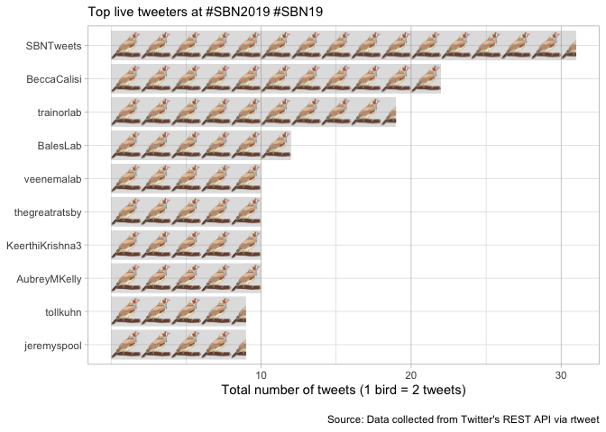

### Basic summary

There were a total of **324** tweets with the SBN hashtag. These tweets
were authored by **111** different particpants.

    ## # A tibble: 6 x 4
    ##   screen_name  total_tweets  div6 image                                    
    ##   <chr>               <int> <dbl> <chr>                                    
    ## 1 CornilLab               6  1    https://upload.wikimedia.org/wikipedia/c…
    ## 2 raynamharris            6  1    https://upload.wikimedia.org/wikipedia/c…
    ## 3 schulz_lab              6  1    https://upload.wikimedia.org/wikipedia/c…
    ## 4 AubreyMKelly            7  1.17 https://upload.wikimedia.org/wikipedia/c…
    ## 5 LayoDana                7  1.17 https://upload.wikimedia.org/wikipedia/c…
    ## 6 rosvall_lab             7  1.17 https://upload.wikimedia.org/wikipedia/c…

A tibble: 5 x 3
===============

screen\_name text favorite\_count <chr> <chr> <int> 1 SBNTweets
Congratulations to Elizabeth Adkins-Regan, w… 110 2 AubreyMKelly
Interested in bizarre animals that defy expe… 71 3 AubreyMKelly Looks
like I’ll be presenting the world’s ti… 67 4 raynamharris "I’m
presenting a poster today at @SBNTweet… 62 5 SBNTweets Welcome to
@amandakrentzel and @wmkenkel, ou… 53

A tibble: 6 x 3
===============

screen\_name text retweet\_count <chr> <chr> <int> 1 raynamharris "I’m
presenting a poster today at @SBNTweets… 20 2 SBNTweets Congratulations
to Elizabeth Adkins-Regan, wi… 19 3 BeccaCalisi Doing something new at
\#SBN2019 @SBNTweets by… 14 4 wmkenkel Hey \#SBN19 are you interested in
sex differen… 10 5 trainorlab Today’s contributed talks session had
amazing… 8 6 AubreyMKelly Interested in bizarre animals that defy expec…
8

### Which tweeters had the highest impact?

    ## # A tibble: 6 x 8
    ##   screen_name n_tweets n_fav  n_rt mean_fav mean_rt se_fav se_rt
    ##   <chr>          <int> <int> <int>    <dbl>   <dbl>  <dbl> <dbl>
    ## 1 SBNTweets         31   378    51    12.2    1.65    3.69 0.611
    ## 2 trainorlab        19   214    39    11.3    2.05    1.90 0.498
    ## 3 BalesLab          12   116     7     9.67   0.580   2.39 0.260
    ## 4 BeccaCalisi       12   167    32    13.9    2.67    2.84 1.16 
    ## 5 jeremyspool        9    74     5     8.22   0.56    2.78 0.377
    ## 6 tollkuhn           9    93    19    10.3    2.11    2.25 0.351

### Acknowledgments

My [source
code](https://github.com/raynamharris/cefp2019/blob/master/dataviz/rtweets_SBN2019.Rmd)
was adapted from François Michonneau’s
[code](https://github.com/fmichonneau/2018-carpentrycon-tweets/blob/master/index.Rmd)
that he used to create this [blog post about twitter statistics from
Carpentry Con
2018](https://carpentries.org/2018/06/carpentrycon-tweets). The
[`rtweet` package](https://rtweet.info/) had excellent documentation.
