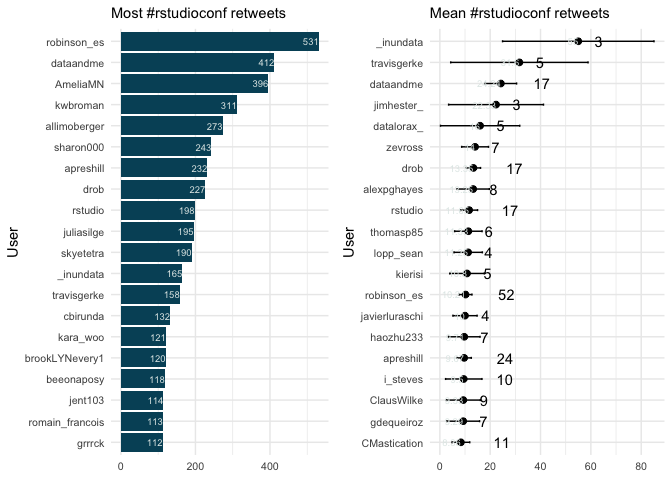
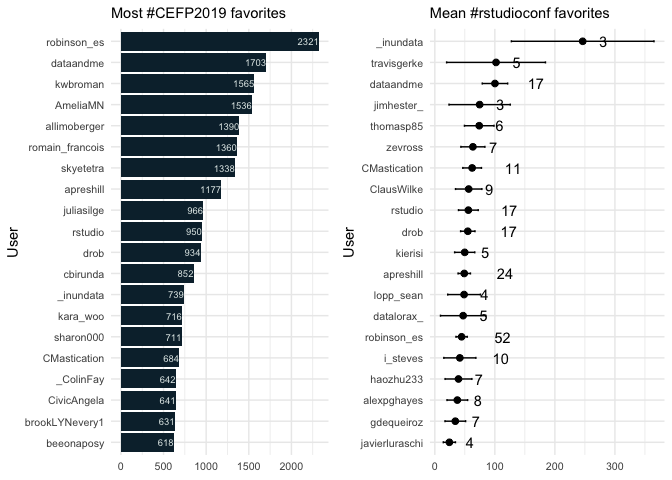

### Basic summary

There were a total of **3644** tweets with the \#rstudioconf hashtag.
These tweets were authored by **692** different particpants.

<table>
<thead>
<tr class="header">
<th style="text-align: left;">screen_name</th>
<th style="text-align: left;">text</th>
<th style="text-align: right;">favorite_count</th>
</tr>
</thead>
<tbody>
<tr class="odd">
<td style="text-align: left;">allimoberger</td>
<td style="text-align: left;">“You shouldn’t feel ashamed about your code - if it solves the problem, it’s perfect just the way it is. But also, it could always be better.” @hadleywickham #rstudioconf</td>
<td style="text-align: right;">489</td>
</tr>
<tr class="even">
<td style="text-align: left;">AmeliaMN</td>
<td style="text-align: left;">The slides for my #rstudioconf talk, Working with Categorical Data in R without Losing your Mind, are available at</td>
<td style="text-align: right;"></td>
</tr>
<tr class="odd">
<td style="text-align: left;"><a href="https://t.co/Ae" class="uri">https://t.co/Ae</a></td>
<td style="text-align: left;">SQZJ74YP</td>
<td style="text-align: right;"></td>
</tr>
<tr class="even">
<td style="text-align: left;">and the paper I</td>
<td style="text-align: left;">’m plugging is at</td>
<td style="text-align: right;"></td>
</tr>
<tr class="odd">
<td style="text-align: left;"><a href="https://t.co/kf" class="uri">https://t.co/kf</a></td>
<td style="text-align: left;">KgPrneQB <a href="https://t.co/RUYabPTGIH" class="uri">https://t.co/RUYabPTGIH</a> 446</td>
<td style="text-align: right;"></td>
</tr>
<tr class="even">
<td style="text-align: left;">travisgerke</td>
<td style="text-align: left;">I took notes in tired/wired format from the <em>incredible</em> #rstudioconf workshop “What they forgot to teach you about R” by @JennyBryan and @jimhester_. Here are some highlights, in case useful for others.</td>
<td style="text-align: right;">428</td>
</tr>
<tr class="odd">
<td style="text-align: left;">robinson_es</td>
<td style="text-align: left;">Data scientists can fail by:</td>
<td style="text-align: right;"></td>
</tr>
<tr class="even">
<td style="text-align: left;">❌not saying no</td>
<td style="text-align: left;">enough</td>
<td style="text-align: right;"></td>
</tr>
<tr class="odd">
<td style="text-align: left;">❌not providing</td>
<td style="text-align: left;">anything more than a cursory analysis</td>
<td style="text-align: right;"></td>
</tr>
<tr class="even">
<td style="text-align: left;">❌assuming PM kn</td>
<td style="text-align: left;">ows enough to ask question in the right way and not collaborating with them</td>
<td style="text-align: right;"></td>
</tr>
<tr class="odd">
<td style="text-align: left;">❌caring more ab</td>
<td style="text-align: left;">out using fancy method than solving business problems</td>
<td style="text-align: right;"></td>
</tr>
<tr class="even">
<td style="text-align: left;">#rstudioconf</td>
<td style="text-align: left;">376</td>
<td style="text-align: right;"></td>
</tr>
<tr class="odd">
<td style="text-align: left;">_inundata</td>
<td style="text-align: left;">Hex stickers are so passé. #rstudioconf <a href="https://t.co/Nv5DCLj9ab" class="uri">https://t.co/Nv5DCLj9ab</a></td>
<td style="text-align: right;">375</td>
</tr>
</tbody>
</table>

A tibble: 5 x 3
===============

screen\_name text retweet\_count <chr> <chr> <int> 1 AmeliaMN “The
slides for my \#rstudioconf talk, Workin… 157 2 travisgerke”I took notes
in tired/wired format from the… 140 3 allimoberger ""You shouldn’t feel
ashamed about your cod… 130 4 \_inundata Slides from my \#rstudioconf
talk on How To M… 105 5 robinson\_es "Data scientists can fail by:❌not
saying n… 95

### Which tweeters had the highest impact?

    ## # A tibble: 6 x 8
    ##   screen_name   n_tweets n_fav  n_rt mean_fav mean_rt se_fav  se_rt
    ##   <chr>            <int> <int> <int>    <dbl>   <dbl>  <dbl>  <dbl>
    ## 1 StatStas           125   223    46     1.78    0.37  0.414 0.0791
    ## 2 cbirunda           106   852   132     8.04    1.25  1.98  0.504 
    ## 3 sharon000          104   711   243     6.84    2.34  0.757 0.254 
    ## 4 malco_barrett       77   396    58     5.14    0.75  0.704 0.150 
    ## 5 tladeras            60   199    28     3.32    0.47  1.11  0.244 
    ## 6 AmeliaMN            57  1536   395    27.0     6.93  9.00  3.05

### Acknowledgments

My [source
code](https://github.com/raynamharris/cefp2019/blob/master/dataviz/rtweets_rstudioconf.Rmd)
was adapted from François Michonneau’s
[code](https://github.com/fmichonneau/2018-carpentrycon-tweets/blob/master/index.Rmd)
that he used to create this [blog post about twitter statistics from
Carpentry Con
2018](https://carpentries.org/2018/06/carpentrycon-tweets). The
[`rtweet` package](https://rtweet.info/) had excellent documentation.
