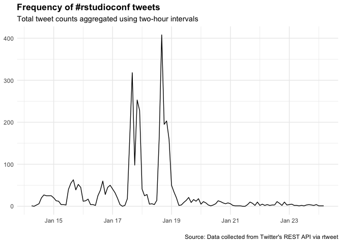

### Basic summary

There were a total of **3643** tweets with the \#rstudioconf hashtag.
These tweets were authored by **692** different particpants.

A tibble: 5 x 3
===============

screen\_name text favorite\_count <chr> <chr> <int> 1 allimoberger “"You
shouldn’t feel ashamed about your co… 489 2 AmeliaMN”The slides for my
\#rstudioconf talk, Worki… 446 3 travisgerke “I took notes in
tired/wired format from th… 428 4 robinson\_es”Data scientists can fail
by:❌not saying … 376 5 \_inundata Hex stickers are so passé.
\#rstudioconf htt… 375

A tibble: 5 x 3
===============

screen\_name text retweet\_count <chr> <chr> <int> 1 AmeliaMN “The
slides for my \#rstudioconf talk, Workin… 157 2 travisgerke”I took notes
in tired/wired format from the… 140 3 allimoberger ""You shouldn’t feel
ashamed about your cod… 130 4 \_inundata Slides from my \#rstudioconf
talk on How To M… 105 5 robinson\_es "Data scientists can fail by:❌not
saying n… 95

### Which tweeters had the highest impact?

    ## # A tibble: 6 x 8
    ##   screen_name   n_tweets n_fav  n_rt mean_fav mean_rt se_fav  se_rt
    ##   <chr>            <int> <int> <int>    <dbl>   <dbl>  <dbl>  <dbl>
    ## 1 StatStas           125   223    46     1.78    0.37  0.414 0.0791
    ## 2 cbirunda           106   852   132     8.04    1.25  1.98  0.504 
    ## 3 sharon000          104   711   243     6.84    2.34  0.757 0.254 
    ## 4 malco_barrett       77   396    58     5.14    0.75  0.704 0.150 
    ## 5 tladeras            60   199    28     3.32    0.47  1.11  0.244 
    ## 6 AmeliaMN            57  1536   395    27.0     6.93  9.00  3.05

### Acknowledgments

My [source
code](https://github.com/raynamharris/cefp2019/blob/master/dataviz/rtweets_rstudioconf.Rmd)
was adapted from François Michonneau’s
[code](https://github.com/fmichonneau/2018-carpentrycon-tweets/blob/master/index.Rmd)
that he used to create this [blog post about twitter statistics from
Carpentry Con
2018](https://carpentries.org/2018/06/carpentrycon-tweets). The
[`rtweet` package](https://rtweet.info/) had excellent documentation.
