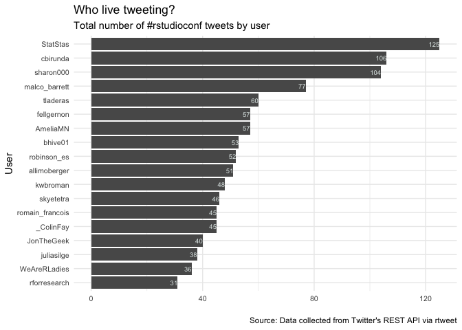

### Basic summary

There were a total of **507** tweets with the \#rstudioconf hashtag.
These tweets were authored by **264** different particpants.

### The 5 most favorited tweets

<table>
<thead>
<tr class="header">
<th style="text-align: left;">screen_name</th>
<th style="text-align: left;">text</th>
</tr>
</thead>
<tbody>
<tr class="odd">
<td style="text-align: left;">hadleywickham</td>
<td style="text-align: left;">dbplyr 1.3.0 is out now: <a href="https://t.co/oZjKCEwYlI" class="uri">https://t.co/oZjKCEwYlI</a> — includes a bunch of minor fixes, most importantly for dplyr 0.8.0 compatibility. I’ll be working on another release after #rstudioconf #rstats</td>
</tr>
<tr class="even">
<td style="text-align: left;">earowang</td>
<td style="text-align: left;">Thrilled to learn #rstats tsibble has been selected as the winner of the 2019 Chambers Award on my way to Austin. My upcoming #rstudioconf talk will showcase rolling forecast with #gganimate and more. Pls come join me at 4pm on Thurs for Melt the 🕐: tidy time series analysis. <a href="https://t.co/jqar7jkk4X" class="uri">https://t.co/jqar7jkk4X</a></td>
</tr>
<tr class="odd">
<td style="text-align: left;">dataandme</td>
<td style="text-align: left;">😭 Missing this year’s #rstudioconf?</td>
</tr>
<tr class="even">
<td style="text-align: left;">Soothe the FOMO by</td>
<td style="text-align: left;">checking out last year’s talks!</td>
</tr>
<tr class="odd">
<td style="text-align: left;"><a href="https://t.co/njMS3" class="uri">https://t.co/njMS3</a></td>
<td style="text-align: left;">zxwKJ #rstats #dataviz <a href="https://t.co/gHBA1pRUG5" class="uri">https://t.co/gHBA1pRUG5</a></td>
</tr>
<tr class="even">
<td style="text-align: left;">JennyBryan</td>
<td style="text-align: left;">Attending the “What They Forgot To Teach You About R” workshop at #rstudioconf?</td>
</tr>
</tbody>
</table>

In body or spirit?

Here’s your pre-workshop homework re: Git & @github setup:

<https://t.co/0NgYoj02n6>  
romain\_francois hex 💅 \#rstudioconf <https://t.co/tpl7Yf7g12>

### The 5 most retweeted tweets

<table>
<thead>
<tr class="header">
<th style="text-align: left;">screen_name</th>
<th style="text-align: left;">text</th>
</tr>
</thead>
<tbody>
<tr class="odd">
<td style="text-align: left;">hadleywickham</td>
<td style="text-align: left;">dbplyr 1.3.0 is out now: <a href="https://t.co/oZjKCEwYlI" class="uri">https://t.co/oZjKCEwYlI</a> — includes a bunch of minor fixes, most importantly for dplyr 0.8.0 compatibility. I’ll be working on another release after #rstudioconf #rstats</td>
</tr>
<tr class="even">
<td style="text-align: left;">dataandme</td>
<td style="text-align: left;">😭 Missing this year’s #rstudioconf?</td>
</tr>
<tr class="odd">
<td style="text-align: left;">Soothe the FOMO</td>
<td style="text-align: left;">by checking out last year’s talks!</td>
</tr>
<tr class="even">
<td style="text-align: left;"><a href="https://t.co/njM" class="uri">https://t.co/njM</a></td>
<td style="text-align: left;">S3zxwKJ #rstats #dataviz <a href="https://t.co/gHBA1pRUG5" class="uri">https://t.co/gHBA1pRUG5</a></td>
</tr>
<tr class="odd">
<td style="text-align: left;">JennyBryan</td>
<td style="text-align: left;">Attending the “What They Forgot To Teach You About R” workshop at #rstudioconf?</td>
</tr>
</tbody>
</table>

In body or spirit?

Here’s your pre-workshop homework re: Git & @github setup:

<https://t.co/0NgYoj02n6>  
earowang Thrilled to learn \#rstats tsibble has been selected as the
winner of the 2019 Chambers Award on my way to Austin. My upcoming
\#rstudioconf talk will showcase rolling forecast with \#gganimate and
more. Pls come join me at 4pm on Thurs for Melt the 🕐: tidy time series
analysis. <https://t.co/jqar7jkk4X> grrrck With \#rstudioconf about to
take over our timelines, I made an easy way to stay on top of everything
\#rstudioconf on Twitter! Part \#FOMO reducer, part tweet explorer, part
Twitter leader board. Hope you like it 😁

<https://t.co/f23r4Qk4ac>

### Which tweeters had the highest impact?

### Acknowledgments

My [source
code](https://github.com/raynamharris/cefp2019/blob/master/dataviz/rtweets_CEFP2019.Rmd)
was adapted from François Michonneau’s
[code](https://github.com/fmichonneau/2018-carpentrycon-tweets/blob/master/index.Rmd)
that he used to create this [blog post about twitter statistics from
Carpentry Con
2018](https://carpentries.org/2018/06/carpentrycon-tweets). The
[`rtweet` package](https://rtweet.info/) had excellent documentation.
